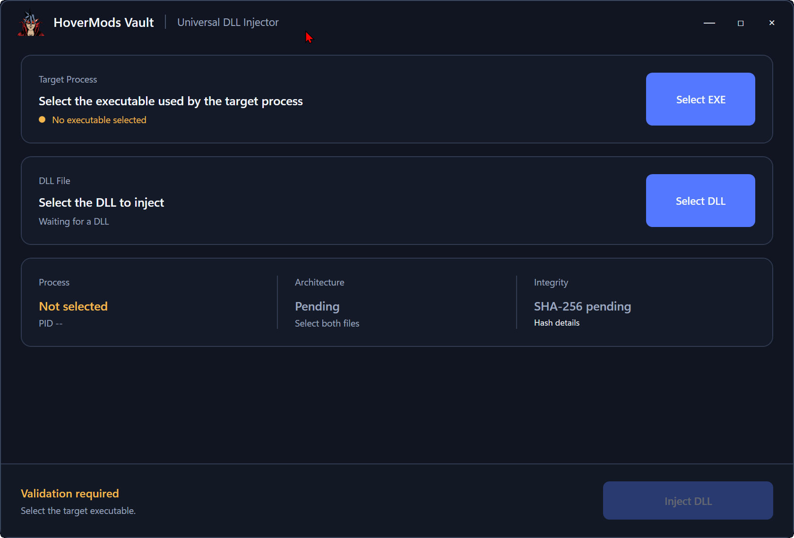

# HMV DLL Injector

A .NET 8 Windows injector using a Control Panel design. It only accepts DLLs listed in a manifest signed by HoverMods Vault.

## Features

- executable selection and active-process detection;
- target selection lock while its PID is running;
- x64 architecture validation;
- SHA-256 and ECDSA P-256 manifest-signature verification;
- explicit `LoadLibraryW` injection;
- lightweight single-EXE publishing;
- local timestamped `HoverMods.DLLInjector.log` file;
- HoverMods Vault branding and a subtle optional visual enhancement.

The **Inject DLL** button remains disabled until the process, architecture, manifest, and exact hash have been validated.

## Quick Start

1. Place `HoverMods.TrustedDlls.json` next to the injector or the DLL.
2. Start `HoverMods.DLLInjector.exe`.
3. Choose the target executable with **Select EXE**.
4. Start the target application. EXE selection is then locked until that PID exits.
5. Select the DLL and confirm that the status reads **HOVERMODS VERIFIED**.
6. Use **Inject DLL**.

## Antivirus Notice

Injection APIs are also used by malicious software, so heuristic detections remain possible, especially for unsigned binaries.

See [CHANGELOG.md](CHANGELOG.md) for the version history.
